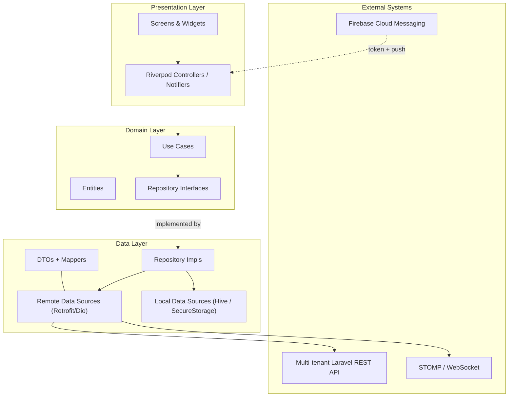

# Implementation Plan — OrderSync Customer Android App

This document describes the phased delivery of the Flutter customer client for OrderSync, a multi-tenant SaaS business-management platform for micro and small businesses. The web platform covers Super Admin, Business Owner, Staff/Cashier, POS, subscriptions, analytics, and the customer-ordering PWA.

---

## 1. Overview

The app is a feature-first, layered Flutter application that talks to the multi-tenant Laravel API over REST, a realtime channel for chat/order updates, and Firebase Cloud Messaging for push. Customers operate inside one selected business storefront. Stock is read-only on the client; the backend validates tenant access, orders, payment records, and customer-specific data.

Tonette's Minimart is the initial seed/demo tenant and must not be encoded as platform branding or a domain assumption.

---

## 2. Architecture

### 2.1 Layered architecture (per feature)

### 2.2 Cross-cutting modules under `lib/core/`

- `network/` — Dio client, interceptors (auth, refresh, logging), typed `ApiException`.
- `storage/` — `SecureStorage` (tokens) and Hive box registry (cart, catalog cache, message cache).
- `routing/` — `go_router` configuration with an auth-guarded redirect.
- `notifications/` — FCM token registration, message routing, local-notification fallback.
- `websocket/` — STOMP client lifecycle, reconnection with backoff.
- `theme/`, `widgets/`, `config/` — design tokens, shared widgets, env accessors.
- `tenant/` — selected-business context, storefront branding, tenant-safe cache keys, and deep-link resolution.
- `uploads/` — private payment-proof selection, validation, compression, retry, and progress.
- `ai/` — AI-support contracts, visible attribution, safety fallbacks, and human handoff.

---

## 3. State Management — Chosen Approach & Justification

**Chosen:** **Riverpod 2.x** with code generation (`riverpod_annotation`, `riverpod_generator`).

**Why Riverpod over BLoC for this app:**

| Criterion | Riverpod | BLoC |
| --- | --- | --- |
| Boilerplate per feature | Low (annotated providers) | Higher (event/state classes per cubit) |
| Compile-time safety | Yes (codegen-typed providers, no `BuildContext` lookups) | Yes |
| Async/streams ergonomics | First-class `AsyncValue`, `StreamProvider` | Requires manual `emit` patterns |
| Testability | Trivial provider overrides | Mock cubit/bloc |
| Fit for CRUD + REST + cache | Excellent (family providers for ids, `keepAlive` for cache) | Good but more code |

BLoC was the runner-up; it would be acceptable but would inflate boilerplate for an app dominated by REST list/detail screens.

---

## 4. API Integration Strategy

### 4.1 Dio client composition

1. Single `Dio` instance built in `dio_client.dart` with `BaseOptions(baseUrl: Env.apiBaseUrl, connectTimeout: 15s, receiveTimeout: 20s)`.
2. Interceptor chain (order matters):
   1. `LoggingInterceptor` (dev/staging only, redacts `Authorization`)
   2. `AuthInterceptor` — attaches `Bearer <accessToken>` from `SecureStorage`.
   3. `RefreshInterceptor` — on `401`, serializes refresh calls with a `Mutex`, exchanges the refresh token, retries the original request; on refresh failure, clears tokens and redirects to login via a routing event.
3. Retrofit-generated typed API clients (`AuthApi`, `BusinessApi`, `CatalogApi`, `OrderApi`, `PaymentApi`, `MessageApi`, `AiSupportApi`, `NotificationApi`) consume the shared `Dio`.
4. Every tenant request includes a business identifier in a server-validated route or token claim. Client-provided tenant identifiers are never trusted as authorization.

### 4.2 Error handling

- All non-2xx responses surface as `ApiException(code, message, details)`.
- Repositories translate `ApiException` into `Result<T, Failure>` (sealed `Failure`: `NetworkFailure`, `AuthFailure`, `ValidationFailure`, `ServerFailure`, `UnknownFailure`).
- Controllers expose `AsyncValue<T>`; screens render loading / error / data uniformly.

### 4.3 Realtime (chat)

- STOMP over WebSocket via `stomp_dart_client`, connected once authenticated.
- Subscribes only to user- and business-authorized destinations for direct messages and order-thread updates.
- Exponential-backoff reconnection (1s → 30s cap) with jitter; STOMP heartbeats every 10s.
- If the WebSocket endpoint is unavailable, the chat feature falls back to a polling provider (every 8s on active thread) — gated by a feature flag.

### 4.4 Push notifications

- FCM token registered with backend on login and on token refresh.
- Foreground messages routed through `flutter_local_notifications`.
- Background/terminated taps deep-link via `go_router` to the relevant order detail or chat thread.

---

## 5. Data Models (Android-side)

Mirrors the backend contract. All models are immutable `@freezed`-style classes (or plain `final` classes with `json_serializable`).

| Model | Key Fields | Notes |
| --- | --- | --- |
| `User` | `id: String`, `email: String`, `fullName: String`, `phone: String?`, `role: 'CUSTOMER'`, `createdAt: DateTime` | Returned from `/auth/me` |
| `BusinessSummary` | `id`, `slug`, `name`, `logoUrl?`, `theme`, `status` | Selected storefront and tenant cache namespace |
| `AuthTokens` | `accessToken: String`, `refreshToken: String`, `expiresAt: DateTime` | Stored in SecureStorage |
| `Category` | `id`, `businessId`, `name`, `iconUrl?` | Used for tenant-scoped filter chips |
| `Product` | `id`, `businessId`, `name`, `description`, `price`, `stockOnHand`, `category`, `imageUrl?`, `barcode?`, `isActive` | `stockOnHand` is display-only |
| `CartItem` | `productId: String`, `productSnapshot: ProductSnapshot`, `quantity: int`, `unitPrice: Decimal` | Persisted in Hive box `cart` |
| `Cart` | `items: List<CartItem>`, `subtotal: Decimal`, `itemCount: int` | Derived from items |
| `OrderStatus` (enum) | `PENDING`, `CONFIRMED`, `REJECTED`, `PREPARING`, `READY_FOR_PICKUP`, `COMPLETED`, `CANCELLED` | Drives UI chip + timeline |
| `OrderItem` | `productId`, `productName`, `quantity`, `unitPrice`, `lineTotal` | Captured at order-creation time |
| `Order` | `id`, `businessId`, `code`, `status`, `items`, `subtotal`, `total`, `placedAt`, `updatedAt`, `statusHistory` | `statusHistory` powers tracking screen |
| `OrderStatusEvent` | `status`, `at`, `note` | One row per status change |
| `ChatThread` | `id`, `kind: 'GENERAL' \| 'ORDER'`, `orderId: String?`, `lastMessage`, `unreadCount`, `updatedAt` | List item on chat home |
| `Message` | `id`, `threadId`, `senderId`, `senderRole`, `body`, `sentAt`, `deliveredAt?`, `readAt?` | Append-only |
| `PaymentRecord` | `id`, `businessId`, `orderId`, `method: 'GCASH' \| 'MAYA'`, `referenceNumber`, `proofUrl`, `status`, `submittedAt`, `verifiedAt?` | Manual verification; no direct wallet API in MVP |
| `AiSupportMessage` | `id`, `threadId`, `source: 'AI' \| 'HUMAN'`, `body`, `citations?`, `sentAt` | AI output is visibly labeled and tenant-grounded |
| `NotificationPayload` | `type: 'ORDER' \| 'MESSAGE' \| 'SYSTEM'`, `referenceId`, `title`, `body`, `receivedAt` | FCM data payload schema |

---

## 6. Phased Plan

Effort is expressed in Fibonacci story points (1, 2, 3, 5, 8, 13). Acceptance criteria are checklist-style and map 1:1 to the matching section in `task.md`.

### Phase 1 — Scaffolding, theming, routing, environment config

- **Objectives:** Replace the default counter scaffold with a production-shaped app skeleton.
- **Dependencies:** None.
- **Deliverables:** Updated `pubspec.yaml`, `lib/main.dart`, `lib/app.dart`, `lib/core/{config,theme,routing}`, build_runner wired, splash & placeholder screens for each top-level route.
- **Acceptance Criteria:**
  - `flutter run` boots into a branded OrderSync shell with storefront selection and bottom navigation (Catalog, Cart, Orders, Messages, Account).
  - `go_router` redirects unauthenticated users to `/login`.
  - `Env` reads all required `--dart-define` values; missing required values fail fast in debug.
  - `dart run build_runner build` succeeds.
- **Effort:** 5

### Phase 2 — Authentication

- **Objectives:** Implement customer registration/login, storefront context, JWT storage, auto-login, logout, and silent refresh.
- **Dependencies:** Phase 1; backend auth endpoints available.
- **Deliverables:** `features/auth/` (Login, Register screens, `AuthRepository`, `AuthController`, token persistence, `AuthInterceptor`, `RefreshInterceptor` with mutex).
- **Acceptance Criteria:**
  - Successful login stores tokens in `flutter_secure_storage` and lands on Catalog.
  - Opening a business deep link selects only an active storefront and namespaces all caches by `businessId`.
  - Cold-start with a valid token skips login.
  - Expired access token triggers exactly one refresh; failed refresh logs the user out.
  - Form validation: email format, password length ≥ 8, phone optional.
- **Effort:** 8

### Phase 3 — Tenant-scoped product catalog

- **Objectives:** Browse, search, and filter products; view detail.
- **Dependencies:** Phase 2.
- **Deliverables:** `features/catalog/` with `CatalogApi`, `ProductRepository`, `CategoryRepository`, `ProductListScreen` (grid, pull-to-refresh, paginated), `ProductDetailScreen`, search bar, category filter chips, Hive-backed last-known catalog cache.
- **Acceptance Criteria:**
  - First page loads ≤ 2s on a warm cache; skeleton shown otherwise.
  - Search debounces 300ms and queries the backend.
  - Out-of-stock products show a disabled "Add to Cart" state.
  - Offline launch renders the cached catalog read-only.
- **Effort:** 8

### Phase 4 — Cart management

- **Objectives:** Local, persisted cart with quantity editing and totals.
- **Dependencies:** Phase 3.
- **Deliverables:** `features/cart/` with Hive box `cart`, `CartController`, `CartScreen`, add/remove/update interactions on `ProductDetailScreen`.
- **Acceptance Criteria:**
  - Cart survives app restart.
  - Quantity cannot exceed `stockOnHand` snapshot; UI explains the cap.
  - Subtotal updates reactively.
  - "Clear cart" requires a confirmation dialog.
- **Effort:** 5

### Phase 5 — Checkout & order creation

- **Objectives:** Convert a cart into a server-side order in `PENDING` state.
- **Dependencies:** Phases 2, 4; backend `POST /orders`.
- **Deliverables:** `features/checkout/CheckoutScreen` (review, optional notes, pickup info), `OrderApi.createOrder`, success screen routing to the new order's detail.
- **Acceptance Criteria:**
  - Submitting checkout yields an `Order` with status `PENDING`.
  - Cart is cleared atomically on success only.
  - Server validation errors surface inline (e.g., product no longer active).
- **Effort:** 5

### Phase 6 — Order tracking & history

- **Objectives:** Show order list, order detail with status timeline, and reflect status updates.
- **Dependencies:** Phase 5; FCM from Phase 10 may arrive later — interim pull-to-refresh is acceptable.
- **Deliverables:** `features/orders/OrderListScreen` (filters: active vs. history), `OrderDetailScreen` with timeline widget, status chip component, cancel-order action where the backend allows.
- **Acceptance Criteria:**
  - All seven statuses render with distinct visual treatment.
  - Cancelling a `PENDING` order updates UI and persists.
  - Pull-to-refresh re-fetches a single order's status.
- **Effort:** 8

### Phase 7 — In-app messaging & AI handoff foundation

- **Objectives:** General and order-scoped chat threads with the selected business, ready for AI support and human handoff.
- **Dependencies:** Phase 2; backend realtime endpoints.
- **Deliverables:** `features/messaging/` with `StompClient` wrapper, `ChatThreadListScreen`, `ChatThreadScreen`, message bubbles, unread badges, polling fallback flag.
- **Recommendation & Justification:** Keep STOMP-over-WebSocket while supported by the backend contract, behind a transport wrapper so Laravel broadcasting or another protocol can replace it without rewriting screens. Polling remains a fallback.
- **Acceptance Criteria:**
  - Sending a message reflects optimistically and confirms on server ack.
  - Reconnection is automatic with exponential backoff.
  - Unread count clears when a thread is opened.
- **Effort:** 13

### Phase 8 — Recorded GCash/Maya payments

- **Objectives:** Let customers record an order payment without depending on direct wallet APIs.
- **Dependencies:** Phases 2, 5, 6; backend payment and private-upload endpoints.
- **Deliverables:** `features/payments/` with business-managed QR/payment instructions, reference-number entry, screenshot/receipt picker, proof preview/compression/upload, payment status/history, and digital receipt views.
- **Acceptance Criteria:**
  - GCash and Maya are presented as recorded/manual-verification methods, not instant API-confirmed payments.
  - Proof file type and size are validated before upload and again by the server.
  - Checkout/order state changes only after server acceptance; fulfillment waits for authorized verification where policy requires it.
  - Customers can see pending, verified, or rejected status and the rejection reason without accessing another customer's proof.
- **Effort:** 8

### Phase 9 — AI-assisted customer support

- **Objectives:** Answer product, stock availability, order-status, FAQ, and announcement questions with safe human handoff.
- **Dependencies:** Phases 2, 3, 6, 7; backend provider adapter and knowledge endpoints.
- **Deliverables:** `features/ai_support/` with assistant entry point, AI-labeled messages, suggested questions, order-context consent, retry/fallback, and transfer to business chat.
- **Acceptance Criteria:**
  - AI answers are grounded only in the selected business's published data and the authenticated customer's own orders.
  - Uncertain, sensitive, or unsupported questions offer human handoff.
  - The mobile client contains no provider API key; provider choice (OpenAI, Claude, or another option) remains server-configured.
- **Effort:** 8

### Phase 10 — Firebase Cloud Messaging

- **Objectives:** Receive and react to push notifications in all three app states.
- **Dependencies:** Phase 2 (auth) and Firebase project configured.
- **Deliverables:** `core/notifications/FcmService` (token register/refresh against backend), foreground handler bridging to `flutter_local_notifications`, background isolate handler, tap-routing into the app.
- **Acceptance Criteria:**
  - Killing and relaunching the app preserves token registration.
  - Tapping an `ORDER` notification opens the matching order detail; `MESSAGE` opens the matching thread.
  - Notifications are deduplicated against in-app updates when the relevant screen is already foreground.
- **Effort:** 8

### Phase 11 — Polish

- **Objectives:** Production-quality UX.
- **Dependencies:** Phases 1–10.
- **Deliverables:** Skeleton loaders, empty/error states with retry, global snackbar service, offline banner driven by `connectivity_plus`, accessibility audit (semantics labels, tap-target sizes, contrast), localization stub with English baseline, app icon and splash.
- **Acceptance Criteria:**
  - Every list/detail screen has loading, empty, and error variants.
  - TalkBack reads every interactive element meaningfully.
  - App launches with a branded splash and adaptive icon.
- **Effort:** 5

### Phase 12 — Testing, hardening, release

- **Objectives:** Ship a Play-Store-ready AAB.
- **Dependencies:** Phase 11.
- **Deliverables:** Unit + widget + integration test suites, CI workflow (`flutter analyze`, `flutter test`, build AAB), release signing config, ProGuard/R8 keep rules, privacy policy URL, store listing assets checklist.
- **Acceptance Criteria:**
  - `flutter analyze` clean.
  - Coverage ≥ 70% on `features/**/domain` and `features/**/data`.
  - Signed AAB builds in CI and installs on a clean device via internal testing.
  - Crash-free sessions ≥ 99% over a 24h soak on internal testing.
- **Effort:** 8

---

## 7. Risks & Mitigations

| # | Risk | Likelihood | Impact | Mitigation |
| --- | --- | --- | --- | --- |
| R1 | Backend contract changes mid-build | Medium | High | Pin OpenAPI version, generate DTOs from spec, version-lock per release |
| R2 | Realtime endpoint delayed | Medium | Medium | Ship polling fallback behind a feature flag (Phase 7) |
| R3 | FCM token churn / silent unsubscription | Low | Medium | Re-register token on each cold start and on `onTokenRefresh` |
| R4 | Stale `stockOnHand` causing failed checkout | Medium | Medium | Backend re-validates at order creation; surface validation error cleanly |
| R5 | Refresh-token race conditions | Medium | High | Single `Mutex` around refresh in `RefreshInterceptor`; queue retried requests |
| R6 | Play Store rejection (permissions, data-safety form) | Low | High | Audit permissions in Phase 9; only request `INTERNET`, `POST_NOTIFICATIONS`, and Firebase basics |
| R7 | Offline divergence between cached cart and updated catalog | Medium | Low | Treat cart prices as snapshots; re-price on checkout server-side |
| R8 | WebSocket battery/data drain on poor networks | Low | Medium | Disconnect on app background after 30s; reconnect on resume |
| R9 | Cross-tenant cache/data exposure | Low | Critical | Namespace all caches, routes, and provider families by business; add tenant-isolation integration tests |
| R10 | Fraudulent or oversized payment proof | Medium | High | Private storage, type/size validation, duplicate signals, manual verification, and immutable reviewer log |
| R11 | AI hallucination or tenant leakage | Medium | High | Server-side authorization, retrieval allowlists, AI labels, human handoff, and adversarial tests |

---

## 8. Definition of Done (MVP)

**Functional**
- All Must-Have features in `README.md` are implemented and demoable end-to-end.
- All seven order statuses round-trip correctly with the backend.
- Chat works in foreground, background, and after a kill + relaunch.
- Push notifications deep-link correctly from cold start.
- Business selection and every cached/requested record remain tenant-scoped.
- A customer can submit GCash/Maya proof and track manual verification status.
- AI support answers tenant-grounded questions and safely hands off.

**Non-functional**
- `flutter analyze` is clean; lints enforced in CI.
- Unit + widget test coverage ≥ 70% on `features/**/domain` and `features/**/data`.
- Integration tests cover login → business selection → checkout → payment proof → order detail, plus tenant-isolation and AI-handoff cases.
- Cold start to interactive Catalog ≤ 3s on a mid-range Android device.
- No `INTERNET` traffic over plain HTTP in release builds (`usesCleartextTraffic=false`).
- Signed AAB built reproducibly from `main` via CI.
- Crash-free sessions ≥ 99% over the final internal-testing soak.

**Documentation**
- `README.md`, `implementation_plan.md`, and `task.md` are current.
- Release notes drafted for the first internal-testing rollout.
