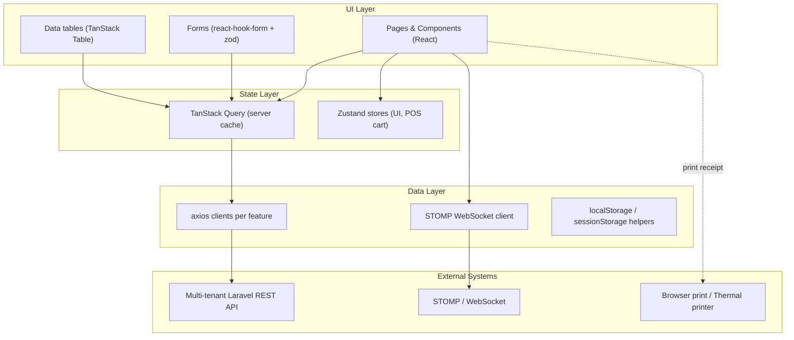

# Implementation Plan — OrderSync SaaS Web Platform

This document describes the phased delivery of the OrderSync web platform: Super Admin console, tenant-scoped business workspace and POS, analytics, subscription management, and customer-ordering PWA. The Flutter customer app is a companion client documented separately.

---

## 1. Overview

A React + TypeScript application built with Vite and backed by the repository's Laravel API. OrderSync is multi-tenant: **Super Admin** manages the platform; **Business Owner** and **Staff/Cashier** operate a single business; **Customer** uses one selected storefront. The backend is the source of truth and must enforce tenant isolation, role permissions, subscription entitlements, and audited state changes.

Tonette's Minimart is seed/demo data for the pilot tenant, never a platform-level assumption.

---

## 2. Architecture

### 2.1 Layered architecture (per feature)

### 2.2 Cross-cutting modules under `src/shared/`

- `api/` — axios instance, interceptors (auth, refresh, error normalization), per-feature API modules.
- `ws/` — STOMP client lifecycle, subscription registry, exponential-backoff reconnection.
- `components/` — shadcn primitives plus `DataTable`, `EmptyState`, `ErrorState`, `ConfirmDialog`, `Money`, `StatusChip`.
- `hooks/` — `useDebounce`, `useBarcodeScanner`, `usePrintReceipt`, `useRole`, `useStompSubscription`.
- `config/env.ts` — zod-parsed `import.meta.env` with typed exports.
- `lib/` — money/decimal math, date formatting, RBAC predicates, csv/pdf helpers.
- `tenant/` — active-business context, tenant-aware query keys, business switch protection, and entitlement helpers.
- `pwa/` — manifest, service worker, install prompt, cache policy, and offline-draft coordination.

---

## 3. State Management — Chosen Approach & Justification

**Chosen:**
- **TanStack Query** for all server-derived state (lists, details, mutations, optimistic updates, cache invalidation).
- **Zustand** for the few pieces of true client-only state (POS draft cart, sidebar collapsed flag, toast queue).

**Why this combo over Redux Toolkit:**

| Criterion | TanStack Query + Zustand | Redux Toolkit |
| --- | --- | --- |
| Server cache primitives | First-class (stale time, refetch, retries) | Manual (RTK Query partial) |
| Boilerplate per feature | Low (`useQuery` / `useMutation` hooks) | Moderate (slices, thunks) |
| Optimistic updates | Built-in | Manual |
| Realtime invalidation from WS | `queryClient.invalidateQueries` one-liner | Custom plumbing |
| Footprint for UI-only state | Tiny via Zustand | Same store everywhere |

Redux Toolkit was the runner-up; it would be acceptable but inflates boilerplate for an app dominated by CRUD-over-REST screens.

---

## 4. API Integration Strategy

### 4.1 axios client composition

1. Single `axios` instance built in `src/shared/api/axios.ts` with `baseURL` from `env.ts`, `withCredentials: true` (for refresh-token cookie), and 20s timeout.
2. Interceptor chain:
   1. **Request — `authInterceptor`**: attaches `Authorization: Bearer <accessToken>` from in-memory `AuthStore`.
   2. **Response — `refreshInterceptor`**: on `401`, queues subsequent requests, fires one `POST /auth/refresh`, retries the original; on refresh failure clears auth and navigates to `/login`.
   3. **Response — `errorInterceptor`**: normalizes responses into a typed `ApiError` (`{ code, message, fieldErrors? }`).
3. Per-feature modules expose typed functions (e.g. `listProducts(params)`, `createProduct(payload)`) returning `Promise<T>`.

### 4.2 Error handling

- API modules throw typed `ApiError`.
- TanStack Query surfaces errors via `useQuery`'s `error` and `useMutation`'s `onError`.
- A global `ErrorBoundary` catches render-time errors; an app-level toast surfaces network/server failures.
- Field-level validation errors from the server are merged into `react-hook-form` via `setError` per `fieldErrors` entry.

### 4.3 Realtime

- STOMP client connects after successful login, using the access token in the CONNECT headers.
- Subscriptions:
  - `/user/queue/messages` — messages authorized for the signed-in user and business.
  - `/topic/businesses/{businessId}/orders` — new and updated customer orders.
  - `/topic/businesses/{businessId}/inventory/low-stock` — low-stock notifications for the selected business.
- On any inbound frame, the relevant TanStack Query keys are invalidated (`['orders']`, `['messages', threadId]`, `['inventory']`).
- Exponential backoff reconnection (1s → 30s cap) with jitter; STOMP heartbeats every 10s.
- Browser tab visibility: pause subscriptions on `visibilitychange` to `hidden` after 60s; resume immediately on `visible`.

### 4.4 Token handling

- **Access token** kept only in memory (Zustand `AuthStore`); never written to `localStorage`.
- **Refresh token** delivered as `Secure; HttpOnly; SameSite=Strict` cookie set by the backend on login; the SPA cannot read it (XSS-safe).
- Cold reload re-bootstraps via `POST /auth/refresh` (cookie sent by browser).

---

## 5. Data Models (Web-side TypeScript)

Mirrors the backend contract. All shapes live under `src/shared/types/` and are derived from zod schemas in `src/shared/api/*`.

| Type | Key Fields | Notes |
| --- | --- | --- |
| `User` | `id`, `businessId?`, `email`, `fullName`, `role: 'SUPER_ADMIN' \| 'BUSINESS_OWNER' \| 'STAFF' \| 'CASHIER' \| 'CUSTOMER'`, `isActive`, `createdAt` | `businessId` is absent only for platform-scoped Super Admins |
| `AuthSession` | `accessToken: string`, `accessExpiresAt: string`, `user: User` | Refresh handled by cookie |
| `Business` | `id`, `slug`, `name`, `status`, `ownerId`, `branding`, `settings`, `createdAt` | Tenant boundary and storefront identity |
| `SubscriptionPlan` | `id`, `name: 'BASIC' \| 'STANDARD' \| 'PREMIUM'`, `price`, `billingPeriod`, `entitlements`, `isActive` | Super Admin-managed and configurable |
| `Subscription` | `id`, `businessId`, `planId`, `status`, `startsAt`, `renewsAt`, `endsAt?` | Controls access without deleting tenant data |
| `Category` | `id`, `businessId`, `name`, `iconUrl?` | Business Owner-managed |
| `Product` | `id`, `businessId`, `sku`, `barcode?`, `name`, `description`, `categoryId`, `price: string` (decimal), `costPrice?`, `stockOnHand`, `lowStockThreshold`, `isActive` | `stockOnHand` server-owned |
| `InventoryMovement` | `id`, `businessId`, `productId`, `delta`, `reason`, `note?`, `actorId`, `occurredAt` | Append-only tenant audit log |
| `StockAdjustment` | `productId`, `delta`, `reasonCode`, `note` | Form payload |
| `RestockEntry` | `productId`, `quantity`, `supplierRef?`, `note?` | Restock workflow |
| `CartLine` (POS) | `productId`, `productSnapshot`, `quantity`, `unitPrice`, `lineDiscount?` | Local Zustand only |
| `PosSale` | `id`, `code`, `lines: CartLine[]`, `subtotal`, `taxTotal`, `discountTotal`, `grandTotal`, `paymentMethod: 'CASH' \| 'CARD' \| 'OTHER'`, `tendered?`, `change?`, `cashierId`, `completedAt`, `receiptNumber` | Created server-side on finalize |
| `OrderStatus` (enum) | `PENDING`, `CONFIRMED`, `REJECTED`, `PREPARING`, `READY_FOR_PICKUP`, `COMPLETED`, `CANCELLED` | Status pipeline |
| `Order` | `id`, `businessId`, `code`, `customer`, `items`, `subtotal`, `total`, `status`, `placedAt`, `updatedAt`, `statusHistory` | Confirmation triggers inventory deduction server-side |
| `OrderItem` | `productId`, `productName`, `quantity`, `unitPrice`, `lineTotal` | Snapshot at placement time |
| `PaymentRecord` | `id`, `businessId`, `purpose: 'ORDER' \| 'SUBSCRIPTION'`, `method: 'GCASH' \| 'MAYA'`, `referenceNumber`, `proofUrl`, `status`, `submittedBy`, `verifiedBy?`, `verifiedAt?` | Manual verification; no direct wallet API in MVP |
| `ChatThread` | `id`, `businessId`, `kind: 'GENERAL' \| 'ORDER' \| 'AI_SUPPORT'`, `orderId?`, `customer`, `lastMessage`, `unreadCount`, `updatedAt` | Tenant-scoped conversation |
| `Message` | `id`, `threadId`, `senderId`, `senderRole`, `body`, `sentAt`, `deliveredAt?`, `readAt?` | Append-only |
| `KnowledgeEntry` | `id`, `businessId?`, `kind`, `question`, `answer`, `isPublished`, `updatedAt` | Tenant FAQs/announcements or platform defaults |
| `SalesReportRow` | `bucket: string` (date / week / month), `salesCount`, `grossTotal`, `discountTotal`, `netTotal` | Dashboard + reports |
| `LowStockAlert` | `productId`, `productName`, `stockOnHand`, `threshold` | Admin banner + dashboard widget |

---

## 6. Phased Plan

Effort is expressed in Fibonacci story points (1, 2, 3, 5, 8, 13). Acceptance criteria are checklist-style and map 1:1 to the matching section in `task.md`.

### Phase 1 — Project scaffold, theming, routing, env, app shell

- **Objectives:** Stand up a production-shaped React + Vite + TypeScript project with Tailwind, shadcn/ui, a typed env layer, and a navigable app shell.
- **Dependencies:** None.
- **Deliverables:** `package.json`, `vite.config.ts`, `tsconfig.json`, `tailwind.config.ts`, `src/main.tsx`, `src/App.tsx`, `src/app/layout/{AppShell,Sidebar,Topbar}.tsx`, `src/app/router/routes.tsx`, `src/shared/config/env.ts`, placeholder pages for every top-level route.
- **Acceptance Criteria:**
  - `npm run dev` boots a themed shell with sidebar nav and topbar.
  - `npm run build` succeeds and `npm run preview` renders the same shell.
  - All required `VITE_*` env vars are validated at boot and fail fast when missing.
  - ESLint + Prettier + Vitest configured; example unit test passes.
- **Effort:** 5

### Phase 2 — Authentication, tenancy & role-based access

- **Objectives:** Implement login, tenant context, in-memory access token + httpOnly refresh cookie, four-role routing, entitlement guards, and logout.
- **Dependencies:** Phase 1; backend auth endpoints.
- **Deliverables:** `features/auth/pages/LoginPage.tsx`, `app/providers/AuthProvider.tsx`, `app/router/{RequireAuth,RequireRole}.tsx`, `shared/api/auth.ts`, `shared/api/axios.ts` interceptors with refresh mutex, `shared/hooks/useRole.ts`.
- **Acceptance Criteria:**
  - Super Admin sees platform routes; Business Owner and Staff/Cashier see only their business workspace; Customer sees only storefront routes.
  - Every tenant-scoped request is rejected if its route business does not match the authenticated membership.
  - Cold reload with a valid refresh cookie re-bootstraps the session without prompting.
  - Expired access token triggers exactly one refresh; failed refresh routes to `/login`.
  - Routes guarded by `RequireRole` 404 (or redirect) for unauthorized roles.
- **Effort:** 8

### Phase 3 — Role-aware dashboards

- **Objectives:** Role-aware dashboards for platform and tenant operations.
- **Dependencies:** Phase 2; backend reporting endpoints (or stubs).
- **Deliverables:** `features/dashboard/pages/DashboardPage.tsx` with role-specific KPI cards, tenant sales trends, recent orders, low-stock alerts, and the platform-level Super Admin summary.
- **Acceptance Criteria:**
  - Staff/Cashier sees today's sales, open orders, and a quick link to POS.
  - Business Owner sees sales trends, revenue, best sellers, slow movers, low stock, inventory reports, and customer purchase trends.
  - Super Admin sees registered businesses, active subscriptions, monthly platform revenue, platform transactions, total users, and system health.
  - Loading and empty states render correctly for each widget.
- **Effort:** 5

### Phase 4 — Catalog & category management

- **Objectives:** Business Owner CRUD for products and categories; read-only or policy-limited access for Staff/Cashier.
- **Dependencies:** Phase 2.
- **Deliverables:** `features/catalog/pages/{ProductListPage,ProductFormPage,CategoryListPage}.tsx`, image upload widget, `shared/api/catalog.ts`, zod schemas, `DataTable` with search, sort, filter, and pagination.
- **Acceptance Criteria:**
  - Business Owner can create, edit, deactivate, and reactivate a product; SKU/barcode uniqueness is enforced per business.
  - Categories are managed within the current business and cannot be deleted while in use.
  - Staff/Cashier users see only the controls granted by business policy.
- **Effort:** 8

### Phase 5 — Inventory management & movement logs

- **Objectives:** Inspect stock, perform adjustments, perform restocks, audit movement.
- **Dependencies:** Phase 4.
- **Deliverables:** `features/inventory/pages/{InventoryListPage,MovementLogPage,RestockPage}.tsx` and `AdjustStockDialog.tsx`, low-stock banner in `AppShell` for admin, reason-coded adjustment form, restock form supporting multi-line entries.
- **Acceptance Criteria:**
  - Every adjustment requires a reason code and optional note; submission writes a movement record.
  - Restocking adds positive movements with `reason='RESTOCK'`.
  - Movement log is filterable by date range, product, and reason; CSV export available.
  - Low-stock and reorder alerts appear for authorized users when a product reaches its tenant-configured threshold.
- **Effort:** 8

### Phase 6 — POS module

- **Objectives:** Cashier completes walk-in sales: scan / search → cart → payment → finalize → receipt.
- **Dependencies:** Phases 2, 4; backend `POST /pos/sales`.
- **Deliverables:** `features/pos/pages/PosPage.tsx`, `components/{ScanInput,CartPanel,PaymentDialog,ReceiptView}.tsx`, `shared/hooks/useBarcodeScanner.ts` (USB keyboard-wedge: time-windowed character buffer; webcam fallback via `@zxing/browser`), `shared/hooks/usePrintReceipt.ts` (browser print with print-friendly stylesheet).
- **Acceptance Criteria:**
  - Scanning a known barcode adds the product to the cart in ≤ 200 ms.
  - Unknown barcode shows a toast and a manual-search affordance.
  - Cart supports quantity edit, line discount (admin-policy gated), line remove, and clear-all with confirmation.
  - Finalizing the sale is a single server transaction; only on success the cart is cleared and the receipt opens.
  - Receipt renders correctly under `window.print()` on a thermal-printer profile (A8 / 80 mm).
  - Keyboard shortcuts: scan focus, qty edit, finalize, cancel.
- **Effort:** 13

### Phase 7 — Order management

- **Objectives:** List, view, and progress tenant-scoped customer orders through the seven-status pipeline.
- **Dependencies:** Phase 2; STOMP from Phase 8 may arrive later (interim polling acceptable).
- **Deliverables:** `features/orders/pages/{OrderListPage,OrderDetailPage}.tsx`, `components/StatusChip.tsx`, transition actions (Confirm, Reject, Mark Preparing, Mark Ready, Mark Completed, Cancel) with role + status gates.
- **Acceptance Criteria:**
  - All seven statuses render distinctly.
  - Only legal transitions are offered (e.g. `PENDING → CONFIRMED | REJECTED | CANCELLED`).
  - Confirming an order triggers backend-side stock deduction; failure (insufficient stock, inactive product) is surfaced inline with the offending line.
  - Order list is filterable by status, date range, and customer; sortable by `placedAt` and `total`.
- **Effort:** 8

### Phase 8 — Messaging & AI handoff foundation

- **Objectives:** Real-time, tenant-scoped chat between a business and its customers, with an AI-support entry point and human handoff.
- **Dependencies:** Phase 2; backend STOMP endpoints.
- **Deliverables:** `features/messaging/pages/ChatPage.tsx`, thread list, thread view with optimistic send + server-ack reconciliation, unread badges, system-message rendering ("Order confirmed"), `shared/ws/stompClient.ts`, polling fallback flag.
- **Recommendation & Justification:** Keep STOMP-over-WebSocket while the backend contract supports it; isolate the transport behind a client wrapper so Laravel broadcasting or another protocol can replace it without rewriting screens. Long polling remains a fallback.
- **Acceptance Criteria:**
  - New customer messages appear in the correct tenant thread within ≤ 2 s of being sent.
  - Reconnection is automatic with exponential backoff; UI shows a "reconnecting" indicator.
  - Opening a thread marks it read; unread count updates immediately.
- **Effort:** 13

### Phase 9 — Analytics, reports & exports

- **Objectives:** Business Owner daily, weekly, and monthly sales/revenue analytics, best- and slow-moving products, inventory reports, customer purchase trends, and CSV/PDF export.
- **Dependencies:** Phases 5, 6, 7.
- **Deliverables:** `features/reports/pages/{SalesReportPage,OrdersReportPage,InventoryReportPage}.tsx` with Recharts visualizations, bucket selector (day / week / month), date-range picker, CSV export via `papaparse`, PDF export via `@react-pdf/renderer` (client-side) or backend stream (whichever the backend exposes first).
- **Acceptance Criteria:**
  - Each report has at least one chart and one tabular view.
  - CSV export contains the same rows currently visible after filters.
  - PDF export is paginated, includes header/footer, and prints cleanly.
- **Effort:** 8

### Phase 10 — Business users & settings

- **Objectives:** Business Owner manages Staff/Cashier accounts and configures the business profile.
- **Dependencies:** Phase 2.
- **Deliverables:** `features/users/pages/{UserListPage,UserFormPage}.tsx`, `features/settings/pages/BusinessSettingsPage.tsx` (store name, address, tax rate, currency symbol, receipt header/footer, default low-stock threshold), self-service password change for any signed-in user.
- **Acceptance Criteria:**
  - Business Owner can create Staff/Cashier accounts, deactivate them, and trigger password resets.
  - Self cannot delete or demote self (server-enforced; UI also disables).
  - Settings updates reflect immediately on subsequent receipts and on low-stock alerts.
- **Effort:** 5

### Phase 11 — Super Admin, business accounts & subscriptions

- **Objectives:** Deliver the platform-owner experience and subscription business model.
- **Dependencies:** Phases 2, 3, 10; platform API endpoints.
- **Deliverables:** Super Admin dashboard; business registration approval/suspension/reactivation; Basic/Standard/Premium plan editor; subscription lifecycle, renewal monitoring, billing records, subscription reports, password reset, user suspension, activity viewer, and role management.
- **Acceptance Criteria:**
  - A Super Admin can approve a new business and activate a selected subscription plan.
  - Suspending a business blocks tenant access without deleting its data; reactivation restores access.
  - Plan entitlements are loaded from the backend and enforced consistently in navigation and actions.
  - Subscription changes and administrative actions are audit logged.
- **Effort:** 13

### Phase 12 — Recorded GCash/Maya payments

- **Objectives:** Record and verify order and subscription payments without direct wallet APIs.
- **Dependencies:** Phases 7 and 11; secure object storage.
- **Deliverables:** business-managed QR/payment instructions, reference-number form, screenshot/receipt upload, proof preview, status timeline (`PENDING_VERIFICATION`, `VERIFIED`, `REJECTED`), staff/Super Admin verification queues, digital receipt, payment history, and payment logs.
- **Acceptance Criteria:**
  - Customers and business owners can submit GCash/Maya payment details and proof for the correct purpose and tenant.
  - Only authorized users can verify or reject a payment, with actor, timestamp, and reason recorded.
  - File type/size is validated; proof is stored privately and accessed through authorized URLs.
  - Documentation and UI never imply direct GCash/Maya API confirmation.
- **Effort:** 8

### Phase 13 — AI chatbot & knowledge management

- **Objectives:** Add tenant-grounded automated support for product, stock, order status, FAQs, and announcements.
- **Dependencies:** Phases 4, 7, 8; backend AI-provider adapter.
- **Deliverables:** customer chat UI, human handoff, tenant FAQ/announcement knowledge base, Super Admin AI configuration, provider abstraction, rate/usage limits, and chatbot usage analytics.
- **Acceptance Criteria:**
  - AI retrieval is restricted to the active business and the authenticated customer's own order data.
  - Unknown or sensitive requests fall back to a human; AI output is visibly labeled.
  - Provider choice is configuration-driven after cost, quality, latency, privacy, and maintenance evaluation.
  - Prompts, tool calls, and usage are auditable without storing unnecessary sensitive content.
- **Effort:** 13

### Phase 14 — Progressive Web App

- **Objectives:** Make the customer ordering surface installable and resilient on mobile browsers.
- **Dependencies:** Phases 1, 4, 7, 12, 13.
- **Deliverables:** manifest, icons, service worker, responsive storefront, install prompt, update flow, cached application shell, read-only catalog cache, and offline-safe cart/message drafts.
- **Acceptance Criteria:**
  - PWA is installable and passes manifest/service-worker checks.
  - Offline mode never reports an order, payment, subscription, or stock mutation as complete before server confirmation.
  - Tenant branding and selected storefront survive install/relaunch safely.
- **Effort:** 8

### Phase 15 — Polish, testing, hardening, release

- **Objectives:** Production-quality UX, automated test coverage, secure deployment.
- **Dependencies:** Phases 1–14.
- **Deliverables:**
  - Skeleton loaders, consistent empty/error states, global toast, offline banner via `navigator.onLine`.
  - Accessibility audit: keyboard navigation, ARIA labels, color-contrast, focus traps in dialogs.
  - English baseline strings extracted into a single module to ease later i18n.
  - Vitest unit/component suites; Playwright E2E suite covering login + POS sale + order confirmation + daily report.
  - CI workflow (lint, type-check, test, build).
  - CSP, security headers, gzip/brotli config sample, nginx config sample.
- **Acceptance Criteria:**
  - `npm run lint`, `npm run build`, `npm run test`, and `npm run e2e` are all green in CI.
  - Coverage ≥ 70% on `src/shared/` and `src/features/**/api` and `src/features/**/hooks`.
  - Lighthouse on the dashboard: Performance ≥ 85, Accessibility ≥ 95 on a mid-range laptop.
  - Deployed build serves over HTTPS with HSTS and a strict CSP.
- **Effort:** 8

---

## 7. Risks & Mitigations

| # | Risk | Likelihood | Impact | Mitigation |
| --- | --- | --- | --- | --- |
| R1 | Backend contract changes mid-build | Medium | High | Pin OpenAPI version; generate zod schemas / types from spec; version-lock per release |
| R2 | STOMP endpoint delayed | Medium | Medium | Ship polling fallback behind a feature flag (Phase 8) |
| R3 | Refresh-token race conditions | Medium | High | Single mutex around refresh in `refreshInterceptor`; queue retried requests |
| R4 | Barcode scanner variance across hardware | Medium | High | Time-windowed buffer with configurable threshold; webcam fallback; manual entry always available |
| R5 | Thermal printer quirks | Medium | Medium | Print-friendly CSS targeting 80 mm; document tested models; keep digital-receipt link as fallback |
| R6 | Concurrent stock writes (POS + order confirmation) | Medium | High | All deductions go through backend transactions; UI shows server-validated errors with offending product |
| R7 | XSS leading to token exfiltration | Low | High | Access token only in memory; refresh token in `Secure; HttpOnly; SameSite=Strict` cookie; strict CSP |
| R8 | Long sessions on cashier terminals (idle abuse) | Medium | Medium | Idle timeout (configurable, default 30 min) prompts re-auth |
| R9 | Reports growing too heavy on the client | Medium | Medium | Server-side aggregation; client only renders bucketed rows |
| R10 | Browser tab pile-up draining WebSocket connections | Low | Medium | Pause subscriptions on hidden tab > 60 s; reconnect on visibility |
| R11 | Cross-tenant data exposure | Low | Critical | Server-side tenant scopes, authorization policies, tenant-aware cache keys, and isolation tests on every resource |
| R12 | Fraudulent or reused payment proof | Medium | High | Manual verification queue, duplicate reference/proof detection, private storage, reviewer audit trail, and no automatic fulfillment before verification |
| R13 | AI hallucination or tenant leakage | Medium | High | Retrieval allowlists, business/order authorization before tools, human handoff, response labeling, and red-team tests |
| R14 | Incorrect subscription enforcement | Medium | High | Backend entitlement service as source of truth, grace-period rules, idempotent renewal handling, and contract tests |

---

## 8. Definition of Done (MVP)

**Functional**
- All Must-Have features in `README.md` are implemented and demoable end-to-end.
- All seven order statuses round-trip correctly with the backend.
- A full POS sale completes in ≤ 10 s from first scan to printed receipt on the target cashier hardware.
- Inventory adjustments and restocks always produce a movement record with reason and actor.
- Chat works in real time and survives a network drop.
- All four roles are demoable with correct platform/tenant route isolation.
- A business registration can be approved, subscribed, suspended, and reactivated without data loss.
- Order and subscription payments can be recorded with GCash/Maya proof and manually verified.
- The AI assistant answers tenant-grounded questions and hands off when it cannot answer safely.
- The customer web surface is installable as a PWA.

**Non-functional**
- ESLint and TypeScript build are clean; type errors block CI.
- Unit + component test coverage ≥ 70% on `src/shared/` and feature `api/` + `hooks/`.
- Playwright covers login, tenant isolation, POS sale, order confirmation, payment proof, subscription lifecycle, AI handoff, and a daily sales report.
- Dashboard initial load ≤ 2 s on a wired connection from a warm cache.
- Lighthouse Performance ≥ 85, Accessibility ≥ 95 on the dashboard.
- HTTPS-only build; strict CSP; no plaintext secrets in the bundle.
- Refresh tokens never leave `HttpOnly` cookies; access tokens never persisted.

**Documentation**
- `README.md`, `implementation_plan.md`, and `task.md` are current.
- Release notes drafted for the first internal-testing rollout.
- nginx/Caddy deployment sample committed under `docs/deploy/`.
